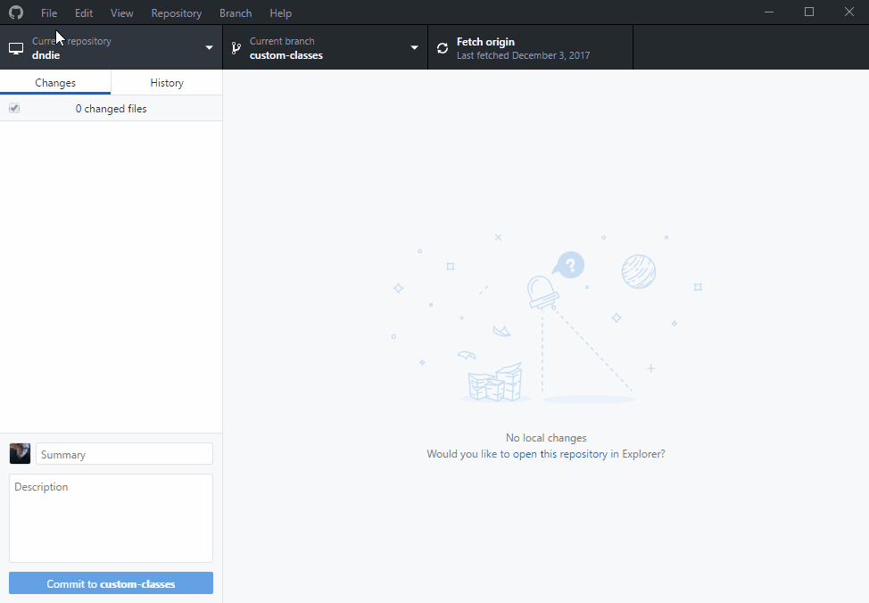
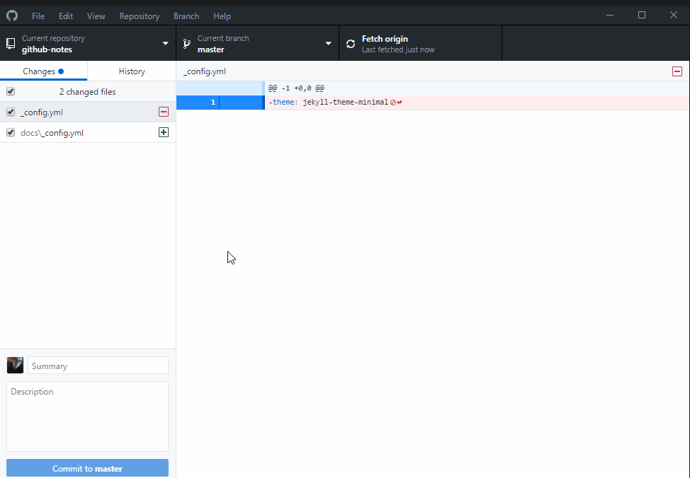
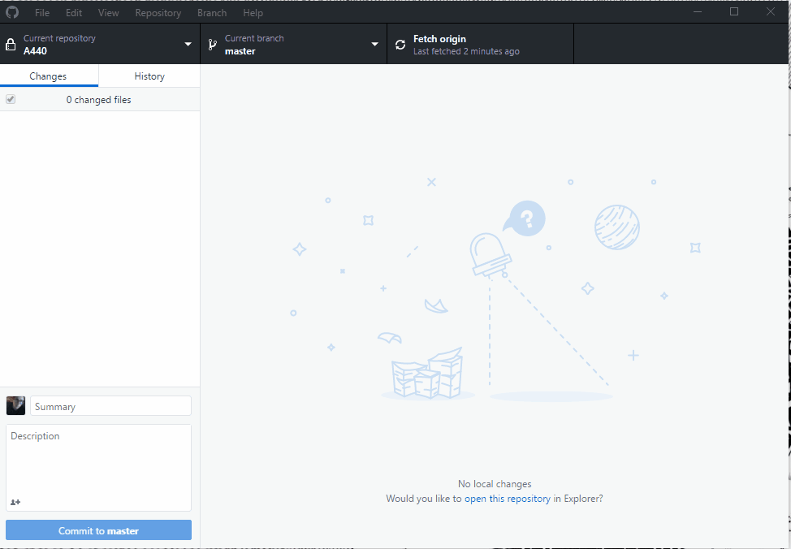

# github-notes

Git is a software that allows you to keep track of changes made to a project over time. Git works by recording the changes you make to a project, storing those changes, then allowing you to reference them as needed.

- [github-notes](#github-notes)
    - [Git Workflow](#git-workflow)
    - [Git Commands](#git-commands)
        - [Initializing](#initializing)
        - [Status](#status)
        - [Adding to the Staging Area](#adding-to-the-staging-area)
    - [Check Differences](#check-differences)
    - [Branches](#branches)
        - [Check Differences Between Branches](#check-differences-between-branches)
    - [Using Git with Github](#using-git-with-github)
    - [Git URLs](#git-urls)
        - [Generating an SSH Key](#generating-an-ssh-key)
        - [Add SSH to GitHub Account](#add-ssh-to-github-account)
        - [Copy SSH Key Remotely](#copy-ssh-key-remotely)
        - [Deploy Keys with AWS](#deploy-keys-with-aws)
    - [Using GitHub Desktop](#using-github-desktop)
    - [Git Hooks](#git-hooks)
        - [Client-side Hooks](#client-side-hooks)
        - [Server-Side Hooks](#server-side-hooks)
        - [Webhooks](#webhooks)
        - [Installation](#installation)
    - [Common Errors](#common-errors)
        - [Could not resolve hostname](#could-not-resolve-hostname)
        - [Continually prompting for username](#continually-prompting-for-username)
        - [Repository or Branch DNE](#repository-or-branch-dne)
        - [Permission Denied (publickey)](#permission-denied-publickey)
    - [Resources](#resources)

## Git Workflow

1. A Working Directory: where you'll be doing all the work: creating, editing, deleting and organizing files
2. A Staging Area: where you'll list changes you make to the working directory
3. A Repository: where Git permanently stores those changes as different versions of the project
    * Changes are saved as a commit

## Git Commands

### Initializing

`git init`

* Initializes an empty Git repository in the current working directory.
* Sets up the tools Git needs to begin tracking changes on the current project.
* Creates a hidden folder /.git/ in the directory where git operates.

### Status

`git status`

* Lists any changes of the contents in the working directory.
* Untracked files will be displayed in red
  * Untracked files do not have any changes stored.
* Green files show changes to a file that need to be committed.

### Adding to the Staging Area
`git add <file>`

* Adds the specified file to be committed (commit) to the repository and tracks changes on the file

```bash
git remote add <remote name> <URL>
git remote add origin https://github.com/user/repo.git
```
* <URL> is the destination of a remote repository.
* The name is anything you give it.
* This adds your local repo to the remote one.

`git add .`
* Shortcut method that will add all files in the current directory except for the ignored files.
  * Ignored files are stored within .gitignore/

## Check Differences
* You can check the differences between tracked local files and files in the repo or staging area.

`git diff <file>`

* Displays changes to a tracked file between the local file and those added to the staging area
* Additions to the file are preceded by a + and in green
* Any missing lines are preceded by a – and in red
* The same lines are in white

`git diff HEAD`
* The most recent change to the last file you committed.

`git diff {branch}@{1} {branch}`

* Displays differences between previous branch version and current version.
  * The previous version is one which was last pushed to repo.

## Branches
`git branch`
* Lists all branches of repository
* Current branch is preceded by an asterisk

`git status`
* Lists the current branch and any differences
* When it says 'up-to-date' it means up-to-date with the branch that the current branch tracks.
  * Usually this is the local reference
  * Not "up-to-date with the latest live status of the upstream.

`git checkout -b <branch-name>`
*	Create a new branch locally.

`git push -u <origin> <branch-name>`
*	To push a local new branch to the remote
*	-u stands for –set-upstream
    * tells git to remember all of the commands so that <git push> will execute the same command as an alias now.

`git pull <origin> <branchName>`
*	Returns any changes that have been made to the files under the folder name.

`git commit`
*	Any files added to the unstaged area which have been changed can be committed to the repository.

`git fetch`
* A local repo won't reflect changes that have been made on the remote repo, so it must be updated first before changes are made.
* `fetch` gets up to date with the commits from the remote repo
  * This does not update the local files so it will not change your local working copy.

`git merge`
* merge moves those commits to the local branch

`git pull`

* Brings the local branch up-to-date with the remote branch.
* Combines `git fetch` and `git merge`

### Check Differences Between Branches

`git fetch`
*	Run git fetch first to make sure the local branch is updated.

`git branch`
*	List all available branches

`git diff (local-branch) (remote-branch)`
*	Compare the differences between each branch.
*	The first listed branch is considered branch A and the second branch is branch B
*	Any changes that are within A that are not in B are preceded by a – and listed in red.
*	Any changes within B but not in A are preceded with a + and listed in green.

## Using Git with Github
1.	Initialize the local directory as a git directory
`git init`
2.	Add all files currently in the directory to be staged for commit
`git add .`
3.	Commit the files you've staged
`git commit -m "First commit"`
4.	Create the new repository on github
5.	Get the github repository's URL from the quick setup page
6.	Add the url for the remote repository
`git remote add origin <URL>`
`git remote -v`
7.	Push the changes to master branch
`git push origin master`

## Git URLs

*	Git provides https or SSH to download and upload.

### Generating an SSH Key

* The command `ssh-keygen` will generate a private and public OpenSSH key with the default name `id_rsa`
    * The key will be located at `~/.ssh/`
        * `~/.ssh` is shorthand for the current user's home directory.
        * The location of the ssh key will be stored in `/home/<username>/.ssh/`

* Github email address is address you use to login `ssh-keygen -t rsa -b 4096 -C “email@address.com”`
    * `-t` specifies the type of key.
    * `-b` specifies the number of bits in the key to create.
        * default is 2048 bits
    * `-C` adds a comment
        * The comment is only serving as a label and not functionality.  It can be generated without it, such as an SSH key for a shared repo on a shared server.
* An SSH key will be generated in a file.
* May add a passphrase for added security.
* ssh-agent manages your SSH keys.
    * the key must be added to ssh-agent to use
* Generate an agent id:
`eval $(ssh-agent -s)`
* Add the private key to the ssh-agent
`ssh-add ~/.ssh/<private_key_name>`

### Add SSH to GitHub Account

* Adding an SSH key to your account will allow you to push/pull to all of your GitHub repos from the server where the SSH key exists since it is identifying the server as you.
    * If this server will be accessible by others, consider using a [deploy key](#deploy-keys) for a specific repo.
* Check for existing keys `ls -al ~/.ssh`
    * will have a .pub extension for the public key
    * The private key will be the same name without an extension.

* Copy the SSH key to your clipboard `clip < ~/.ssh/id_rsa.pub`
    * This will only work if you are working on a local terminal.  If you are using PuTTY or another SSH client, then use [copying SSH remotely](#copy-ssh-key-remotely)
* Go to your user settings on github.
* Click on SSH and GPG keys.
* The “Title” field is only descriptive.
    * Name it after the computer that is accessing github
* “Key” field
    * Paste in the SSH key that was generated through ssh-keygen

### Copy SSH Key Remotely

* If using PuTTY or any other remote SSH client, print the key to the shell:

`ssh-keygen -y -f <key location>`

* `-y` outputs the public key
* `-f` input file
* `<key location>`
    * Usually located at ~/.ssh/id_rsa

### Deploy Keys with AWS

1. Log into root user `sudo su`
2. Run `ssh-keygen` to generate a key.
    1. If a key already exists you can check with `ls -al ~/.ssh`
    2. Leave blank for name and passphrase.  The name will default to id_rsa.
    3. If wanting to use an SSH agent:
        1. Generate an agent id: `eval $(ssh-agent -s)`
        2. Add the private key to the ssh-agent `ssh-add ~/.ssh/<private_key_name>`
3. Print the `ssh-keygen -y -f ~/.ssh/id_rsa` and copy.
    1. If you highlight the text with RMB in PuTTY it will automatically copy.
4. Paste this key into the repo's deploy keys.
5. Test connection to github `ssh -T git@github.com`
    1. If successful what should be displayed is
    ```bash
    Hi {username/repo} You\'ve successfully authenticated, but GitHub does not provide shell access.
    ```
6. Try interacting with the repo!
    1. clone
    2. push
    3. pull

## Using GitHub Desktop

To clone a repository from GitHub onto your local machine:


* After code has been completed in your local environment, commit to the GitHub repo by adding a message and pushing to the repo.
* This can also be done through a CLI with:

```bash
git add <file>
git commit -m "<message>"
git push
```



* GitHub desktop downloads and updates to the folder you specified when cloning.
    * If there are multiple branches, the folder only contains contents of the current branch.
        * Contents of branches do not simultaneously exist in the same folder.
    * You must switch to a different branch through GitHub desktop or the CLI to load those branches.
* GitHub Desktop can open files to be edited in your favorite IDE:


## Git Hooks

* Fires off custom scripts when events occur in the repo.
* Can reside in either local or server-side repositories.
* Hooks are stored in the .git/hooks/ folder of a repo
* The scripts in the /hooks/ folder must be executable and first line must be a shebang magic number that calls the correct script interpreter.
* All default hooks have the extension `.sample`
    * Must remove `.sample` for the script to execute

### Client-side Hooks

* Triggered by committing or merging

### Server-Side Hooks

* Receive pushed commits
* Scripts run before and after pushes to the server.
* When there is a push from a client:
    * `pre-receive`
        * Makes sure none of the updated references are non-fast-forwards.
        * If pusher is trying to push to multiple branches, runs only once.
    * `update`
        * Run once for each branch the pusher is trying to update.
        * If pusher trying to push to multiple branches, runs once per branch they're pushing to.
    * `post-receive`
        * Can be used to update other services or notify users.
            * e-mail
            * notifying a CI server
            * update ticket-tracking system

### Webhooks

### Installation

* Stored in hooks subdirectory of Git project.
    * Usually `.git/hooks`

## Common Errors

### Could not resolve hostname

```bash
git push -u <origin> <branch>
ssh: Could not resolve hostname https: Name or service not known.
```

* The hostname stored in origin is most likely wrong.
* Double check it with: `git remote -v` compared to the link provided at the GitHub repo.
* To change the url: `git remote set-url <origin> <URL>`

### Continually prompting for username

* The hostname stored in origin is most likely wrong.
* Double check it with: `git remote -v` compared to the link provided at the GitHub repo.
* To change the url: `git remote set-url <origin> <URL>`

### Repository or Branch DNE

```bash
git push -u <origin> <branch>
remote: Repository not found
```

```bash
git checkout
you are on a branch yet to be born
```

* Make sure the repository has been initialized locally
* Make sure the repository exists on github.
* Make sure the local repository knows of the remote repository.
    * Double check it with: `git remote -v`
        * If it does not know of the remote repository, get the repository’s address from github.

`git remote add <origin-name> <url>`
*	Add the contents of the folder to be staged: `git add .`
*	Commit the file: `git commit -m “commit message”`
*	Double check you are on the same branch you are trying to push to `git status`
*	If you are not, check the local branches: `git branch`
*	If it does not exist locally `git checkout -b <branch-name>`
*	Push the file `git push -u <origin-name> <branch-name>`


### Permission Denied (publickey)
```bash
Permission denied (publickey).
fatal: Could not read from remote repository.

Please make sure you have the correct access rights
and the repository exists.
```

* Run `ssh -vT git@github.com`
* Start ssh-agent
`ssh-agent -s`
* Check that a public key is loaded into ssh-agent
`ssh-add -l`

## Resources

[Git Hooks](https://git-scm.com/book/gr/v2/Customizing-Git-Git-Hooks)

[Git Hooks Tutorial](https://www.atlassian.com/git/tutorials/git-hooks)

[Webhooks - GitHub](https://developer.github.com/webhooks/)

[Git Hook Tutorial](https://www.digitalocean.com/community/tutorials/how-to-use-git-hooks-to-automate-development-and-deployment-tasks)

[new keys for ssh github](https://help.github.com/articles/generating-a-new-ssh-key-and-adding-it-to-the-ssh-agent/)

[Setting up git with SSH](https://gist.github.com/stormpython/9517102)

[Deploy Keys](https://developer.github.com/v3/guides/managing-deploy-keys/)

[Permission Denied Error](https://help.github.com/articles/error-permission-denied-publickey/)

[git diff master](https://stackoverflow.com/questions/1362952/detail-change-after-git-pull)